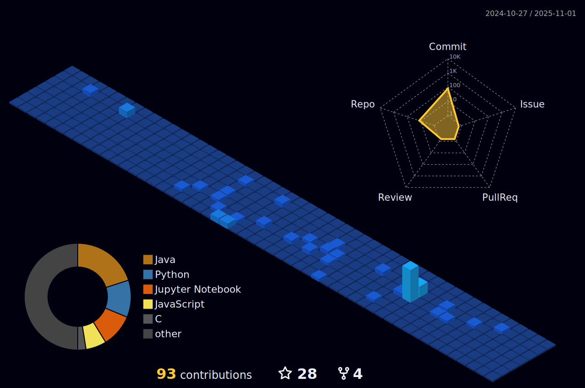

# 
 Hi! I'm Pedro 

    

   

 

   
   
   
   
   
   
   
   
   
   
   
    
   

 

## Social Media

  
  
  <a href="https://www.linkedin.com/in/pedro-henrique-milani-vagula-6a291a21b/" target="_blank">
   

 

 

 
